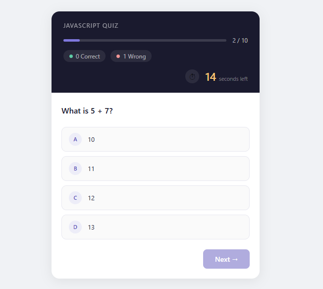
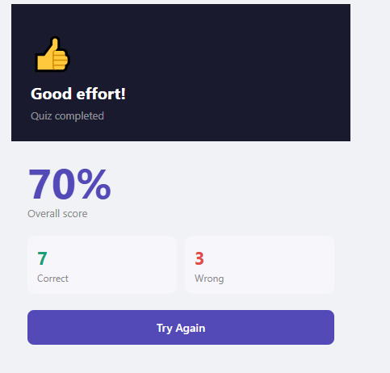

# React Quiz App

> An interactive quiz app built with React.js — test your JavaScript knowledge with 10 questions, live scoring, and instant feedback.
  
**Live Demo:** https://test-app-phi-cyan.vercel.app/

---

## Features

- 10 JavaScript questions with multiple choice options
- 20-second countdown timer per question
- Live correct / wrong score tracking
- Green / red highlight on answer selection
- Progress bar showing quiz completion
- Result screen with trophy and percentage score
- Fully responsive design

---

## Tech Stack

| Technology | Usage |
|------------|-------|
| React.js   | Frontend framework |
| CSS3       | Custom styling |
| JavaScript (ES6+) | App logic |

---
---

## Project Structure

```
src/
├── components/
│   ├── Quiz.jsx       — main quiz logic and layout
│   ├── Question.jsx   — renders the question text
│   ├── Options.jsx    — renders answer buttons with highlights
│   └── Result.jsx     — final score screen
├── App.js             — root component
└── App.css            — all styling
```

---
## 📸 Screenshots
# test-app
<p align="center">
  
  &nbsp;&nbsp;&nbsp;
  
</p>

## Getting Started

### Prerequisites
- Node.js installed on your machine
- npm (comes with Node.js)

### Installation & Run

```bash
### Clone the repository
git clone https://github.com/Bushra3895/test-app.git

### Go into the project folder
cd test-app

### Install dependencies
npm install

### Run locally
npm start
```

App will open at http://localhost:3000

## How It Works

1. Quiz starts with Question 1 of 10
2. Each question has a 20-second timer
3. Select an answer — correct shows green, wrong shows red
4. Click Next to move to the next question
5. After all 10 questions, Result screen shows your score

---
**Author:** Bushra Shabbir

## License

This project is open source and free to use.
